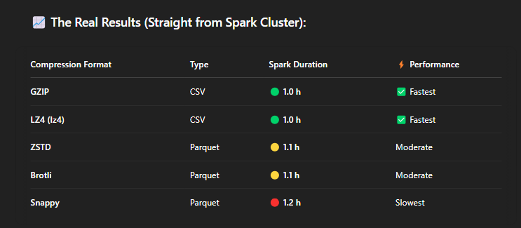

# 🚀 Apache Spark Compression Benchmarking with MinIO S3

> **A personal curiosity project benchmarking how different compression codecs perform in Apache Spark when writing to S3-compatible storage (MinIO).**

## 📌 Motivation

While working with Apache Spark, I noticed most tutorials and guides default to using Snappy for Parquet compression. But Spark also supports other codecs like GZIP, LZ4, ZSTD, and Brotli — each with its own strengths in speed, compression ratio, and compatibility. This project benchmarks these options in a controlled environment.

## ⚙️ Environment & Setup

- **Apache Spark Cluster**: Deployed using Illinois Tech's infrastructure
- **Storage**: MinIO (S3-compatible)
- **Driver Memory**: 4 GB  
- **Executor Memory**: 4 GB  
- **Cores per Executor**: 1  
- **Total Cores**: 12  
- **Platform**: Jupyter Notebook + Spark Web UI

### 🛠️ Technologies Used

- Apache Spark (with PySpark)
- Python
- MinIO (S3-compatible)
- Brotli Hadoop Codec (via JitPack)

## 📂 Dataset

The dataset used was a fixed-width `.txt` weather file stored in MinIO (`s3a://itmd521/50.txt`). It was parsed using PySpark's string manipulation functions to create a structured DataFrame.

```python
df = spark.read.csv('s3a://itmd521/50.txt')
# String manipulation follows...
```

## 📦 Compression Formats Tested



*Compressed files saved to MinIO*


> **Note**: Brotli required manual JAR setup:
> 
> ```xml
> <repository>
>   <id>jitpack.io</id>
>   <url>https://jitpack.io</url>
> </repository>
>
> <dependency>
>   <groupId>com.github.rdblue</groupId>
>   <artifactId>brotli-codec</artifactId>
>   <version>0.1.1</version>
> </dependency>
> ```

## 📈 Key Takeaways

- **GZIP** and **LZ4** were fastest for CSV formats.
- **ZSTD** offers a strong balance for Parquet and is supported in newer Spark versions.
- **Snappy**, while widely compatible, had the slowest write times in this test.
- **Brotli** performed well but requires manual codec setup in Spark.

## 📊 Screenshots

  


  

  
*Compressed files saved to MinIO*

## 🙌 Acknowledgments

Huge thanks to **Professor Jeremy Hajek** and the **Illinois Tech Infrastructure Team** for setting up Spark and MinIO access for students!

Shoutout to mentors and tech leads like **Zach Wilson** and **Deepak Goyal** whose insights inspired me to explore deeper into compression and Spark performance tuning.

---

## 🧪 Want to Try This Yourself?

Clone the repo, edit the bucket path and dataset name, and run the notebook on your Spark setup!

```bash
git clone https://github.com/yourusername/spark-compression-benchmark.git
cd spark-compression-benchmark
```

Feel free to submit a pull request if you improve it!

---

## 🏷️ Tags

`#ApacheSpark` `#MinIO` `#CompressionBenchmark` `#Brotli` `#ZSTD` `#GZIP` `#Snappy` `#LZ4` `#Parquet` `#BigData` `#IllinoisTech` `#SparkSQL`

---

> 📬 Have questions or want help setting up Spark with MinIO? Feel free to reach out or open an issue!
